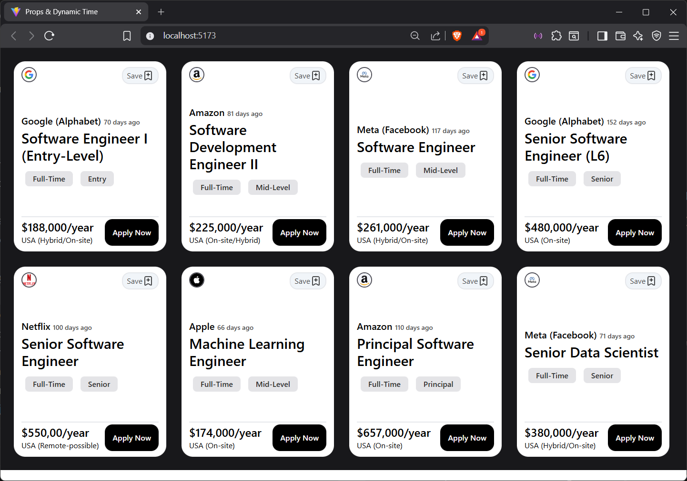

# React Job Listing Dashboard

A modern **React** application that displays job listings in a card format.  
Each card shows company info, job title, experience level, job type, salary, location, and how many days ago the job was posted.

---

## Features

- Dynamic job cards with company logo, title, and details.
- Calculates **“days ago”** from the posted date automatically.
- Fully responsive card layout using **Tailwind CSS**.
- Save button with icon (uses `lucide-react`).
- Flexible to add more jobs by updating the `infoJob` array.
- Styled using **modern UI practices** (rounded corners, shadows, hover effects, etc.)

---

## Technologies Used

- React 18+
- Tailwind CSS
- Lucide-react icons
- JavaScript ES6+

